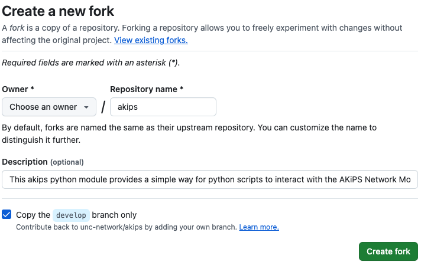

# Contributing to akips

In order to contribute without having to be directly added as a contributor to this project it is best to follow the well known forking strategy. Follow the steps below to fork akips and contribute back to the project from your personal fork.

## Navigate and Fork akips Repository

Navigate to the [AKiPS project](https://github.com/unc-network/akips) on GitHub. Once you're on the main repository page click on the fork button.


You'll then be brought to a screen to complete the fork into your personal user repository.



You'll finally be redirected to your fork, which is linked to the parent repository.

## Clone the akips repository

Next you'll need to clone your forked repository.

```console
% git clone git@github.com:<gituser>/akips.git
Cloning into 'akips'...
remote: Enumerating objects: 484, done.
remote: Counting objects: 100% (79/79), done.
remote: Compressing objects: 100% (66/66), done.
remote: Total 484 (delta 10), reused 28 (delta 7), pack-reused 405 (from 1)
Receiving objects: 100% (484/484), 109.08 KiB | 4.54 MiB/s, done.
Resolving deltas: 100% (225/225), done.
```

Once your forked repository is cloned you can change into the akips directory.

```console
% cd akips
```

Finally you can check the status of git.

```console
% git status
```

Git Status should look similar to the following:

```console
% git status
On branch develop
Your branch is up to date with 'origin/develop'.

nothing to commit, working tree clean

```

## Install Poetry

Poetry is used to manage the dependencies needed for the akips development environment.

Make sure that you add Poetry to your $PATH.

[Poetry Install](https://python-poetry.org/docs/#installing-with-the-official-installer)

```console
% poetry --version
Poetry (version 1.6.1)
```

## Use Poetry to install akips dependencies

This will also create a virtual environment located in .venv.

```console
% poetry install
<"Installing x"...>
```

## Activate virtual environment that has all the needed dependencies

```console
% source .venv/bin/activate
```

## Test your environment is working right

```console
# Should report all files as 'unchanged'
% black --check .
All done! ✨ 🍰 ✨
11 files would be left unchanged.

# Linter should report nothing (at this point)
% ruff check .
All checks passed!

# Type checker should report nothing.  The package ships a py.typed marker,
# so its annotations are a promise to anyone type checking against it.
% mypy
Success: no issues found in 2 source files
```

Unit tests should pass (once again we are testing on unchanged 'develop' branch at this point so everything should pass)

```console
% py.test tests/
============================= test session starts ==============================
platform darwin -- Python 3.10.2, pytest-9.1.1, pluggy-1.6.0
rootdir: /Users/wew/project/akips
configfile: pyproject.toml
collected 88 items

tests/test_api_availability.py .....                                     [  5%]
tests/test_api_db.py .......................                             [ 31%]
tests/test_api_msg.py ......                                             [ 38%]
tests/test_api_script.py .......                                         [ 46%]
tests/test_call.py ...............                                       [ 63%]
tests/test_credentials.py ............                                   [ 77%]
tests/test_import_akips.py .                                             [ 78%]
tests/test_transport.py ...................                              [100%]

============================== 88 passed in 0.19s ==============================
```

The test files mirror the API sections in `akips/__init__.py`, so a test for a
new method belongs in the file for the section it calls.

## Create a branch for your work

```console
% git checkout -b my_cool_work origin/develop
branch 'my_cool_work' set up to track 'origin/develop'.
Switched to a new branch 'my_cool_work'
```

## Make your changes pass the linters and tests

At the end of your changes all four checks MUST pass.  These are the same four
the pipeline runs, so anything failing here will fail there.

```console
% cd {{ repo_base }}
# Use black to autoformat the code
% black .

# Fix any linting errors
% ruff check .

# Fix any typing errors
% mypy

# Unit tests
% py.test tests
```

If mypy complains about missing stubs for a dependency you added, the fix is
usually to add the matching `types-*` package to the dev dependencies.

## Submit your PR to the akips repository

Place a clear statement regarding the purpose of the PR (bug it is fixing, feature it is adding).

For any more meaningful feature, you should open a GitHub issue or discussion first and make sure that we agree on implementing this feature.

The PR will will be sourced from your forked repository + the forked repository branch in use, with the destination of akips's develop branch.
